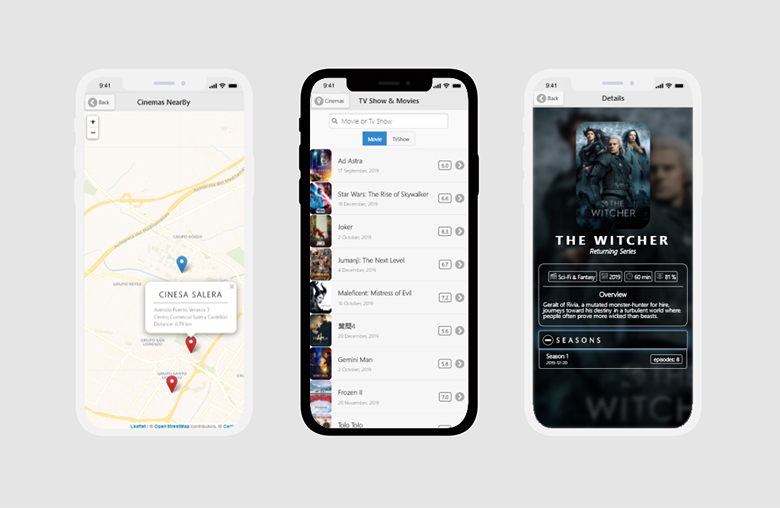

# Tv Shows and Movies App

 A Tv shows and Movies browser web app, with information about nearest cinemas around on a map
 
 demo: http://davidpayares.c1.biz/
 
 
 
Features:
- Main page displays by default the trending movies and tv shows from the current day.
- In the input search box , users can search for information about an specific tv show or movie.
- The search can be done by key words; it can be the full word or just a part of it (better results depend on better key words). 
  If there's no keyword, trending tv shows and movies will be displayed.
- The select menu let the user select between tv shows or movies information.
- The details about the movies show poster and specific data ( title, tagline, status, overview, etc)
- The details about the tv shows display poster and specific data (title, status, date, overview, seasond and episodes)
- The map displays the nearest cinemas to the user location.
- Every cinema marker on map shows cinema name, cinema address and distance between user and cinema.

API source:
- https://www.themoviedb.org/documentation/api
    - Movies and TV Shows data
    - Free and unlimited request. It allows request by any kind of parameter (movies, category, actors, genre , etc.)
- https://developer.movieglu.com/company/about-movieglu/
    - Cinemas data. Request by latitude and longitud 
    - cinemas.json (the second one it's a selection of the response center on UJI of the original api since the limit request it's up to 75)

Problems:
- Limited cinemas data, thus it was neccesary to create a json based on one request.
- The Tv shows and Movie API es very rich, but every detail information has to be search by id, so it implies multiple request by changing the request URL.
